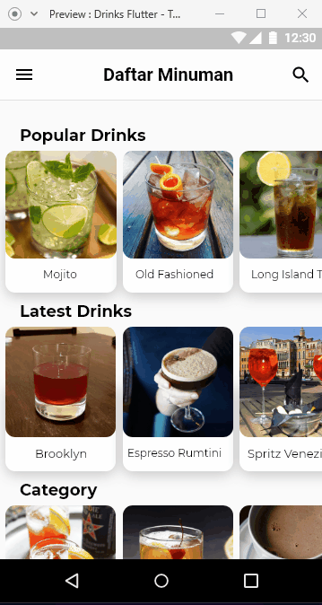

# Drinks Flutter - Daftar Minuman dan Resep  ( Final Project Kelompok 2 - OSG05 )
Aplikasi Flutter tentang daftar minuman beserta resep nya yang berasal dari berbagai negara, sumber API : thecocktaildb.

## Fitur Aplikasi
1. Menampilkan popular drinks dan latest drinks.
2. Menampilkan list drinks berdasarkan category.
3. Favorit drinks.
4. Search drinks berdasarkan nama.
5. Menampilkan halaman about.

## Desain Aplikasi
Aplikasi ini di rancang menggunakan Adobe XD.

#### - Halaman daftar minuman : 

## Showcase Aplikasi

## Built With
- [Flutter](https://flutter.dev)
- [Material Component Widgets](https://flutter.dev/docs/development/ui/widgets/material)
- [StatelessWidget](https://api.flutter.dev/flutter/widgets/StatelessWidget-class.html)
- [StatefulWidget](https://api.flutter.dev/flutter/widgets/StatefulWidget-class.html)
- [Container](https://api.flutter.dev/flutter/widgets/Container-class.html)
- [Card](https://api.flutter.dev/flutter/material/Card-class.html)
- [Icon](https://api.flutter.dev/flutter/widgets/Icon-class.html)
- [ListView](https://api.flutter.dev/flutter/widgets/ListView-class.html)
- [GridView](https://api.flutter.dev/flutter/widgets/GridView-class.html)
- [Navigator](https://api.flutter.dev/flutter/widgets/Navigator-class.html)
- [InkWell](https://api.flutter.dev/flutter/material/InkWell-class.html)
- [MediaQuery](https://api.flutter.dev/flutter/widgets/MediaQuery-class.html)
- [SafeArea](https://api.flutter.dev/flutter/widgets/SafeArea-class.html)
- [Future](https://api.flutter.dev/flutter/dart-async/Future-class.html)
- [Hero](https://api.flutter.dev/flutter/widgets/Hero-class.html)   

## Created By Kelompok 2
- [Muhammad Fari Madyan](https://github.com/MuhammadFariMadyan)
- 
- 
- 
- 

---

### Online Study Group Eudeka!
Salah satu program dari [**Eudeka!**](https://www.eudeka.id) untuk belajar secara _full online_ via Whatsapp/Telegram dan Google Classroom, dengan para praktisi handal di bidangnya. Selain itu juga kamu dapat berkesempatan untuk memperluas koneksimu dengan peserta lain.

### OSG05 - Flutter Basic
Dengan jangka waktu lebih kurang 2 bulan, peserta diharapkan dapat mengenal dan membuat aplikasi simple Flutter dengan menggunakan data dari internet (API).

### Cara Mendaftar Online Study Group
Untuk pendaftaran kelas selanjutnya, silahkan kunjungi atau hubungi kami di dawah ini.

### Info Lebih Lengkap
Website : [www.eudeka.id](https://www.eudeka.id)  
Twitter: [@EudekaID](https://twitter.com/EudekaID)  
Telegram : [@eudekainfo](https://t.me/eudekainfo)  
Instagram : [@eudeka.id](https://instagram.com/eudeka.id)  
WhatsApp : [0895351577557](https://wa.me/62895351577557)  
Email : [info@eudeka.id](mailto:info@eudeka.id)  

---

###### tags: `Flutter` `Eudeka` `OSG05`